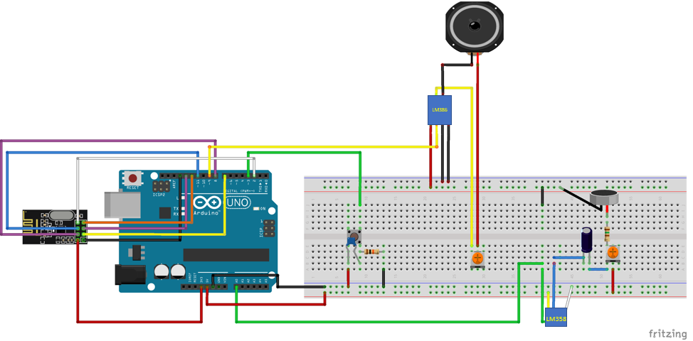

# Table of Contents / Table des matières

[English Version](#arduino-walkie-talkie)
  - [Overview](#overview)
  - [Hardware Requirements](#hardware-requirements)
  - [Software Setup](#software-setup)
  - [Circuit Diagram](#circuit-diagram)
  - [Code Overview](#code-overview)
  - [How to Run](#how-to-run)
  - [Acknowledgments](#acknowledgments)

[Version française](#walkie-talkie-arduino)
  - [Aperçu](#aperçu)
  - [Matériel nécessaire](#matériel-nécessaire)
  - [Configuration du logiciel](#configuration-du-logiciel)
  - [Schéma du circuit](#schéma-du-circuit)
  - [Présentation du code](#présentation-du-code)
  - [Comment exécuter](#comment-exécuter)
  - [Remerciements](#remerciements)

# Arduino Walkie-Talkie
## Overview

This project involves building a functional walkie-talkie system using an Arduino microcontroller and radio transmitter-receiver modules. The goal is to enable wireless voice communication between two devices, with features such as adjustable volume and testing for signal range. It uses two Arduino Uno boards and radio communication modules (NRF24L01) to transmit and receive audio signals. The walkie-talkies feature a microphone, speaker, and basic components to allow wireless voice communication over short distances.

## Hardware Requirements

To recreate this walkie-talkie system, you will need the following components:

- **2 Arduino Uno**: Microcontroller used to handle the transmission and reception of audio signals.
- **2 NRF24L01 Radio Modules**: To transmit and receive audio wirelessly.
- **2 LM386 Amplifier Modules**: To amplify the audio signals to the speaker.
- **2 LM358 Amplifier Modules**: To amplify the audio signals from the microphone.
- **2 8-ohm Speakers**: To output the received audio.
- **2 Electret Microphones**: For audio input.
- **2 10k Ohms resistors**
- **2 150 Ohms resistors**
- **2 100 nF capacitors**
- **2 10 uF capacitors**
- **2 Potentiometers**: For adjusting the volume of the output sound.
- **2 Push Buttons**: To activate the transmitter.

### Optional:
- **9V Batteries** for portable power supply.

## Software Setup

1. **Install Arduino IDE**: Download and install it from the [official Arduino site](https://www.arduino.cc/en/software).
2. **Install Required Libraries**:
   - `RF24.h`: For communicating with the NRF24L01 modules.
   - `RF24Audio.h`: For handling the transmission of audio signals over radio waves.
   You can install these libraries via Arduino's Library Manager.

## Circuit Diagram

### Important Connections:
- **NRF24L01**: Connect CE to Pin 7, CSN to Pin 8, MOSI to Pin 11, MISO to Pin 12, and SCK to Pin 13.
- **Microphone**: Connect the positive pin to the input of the amplifier (LM386).
- **Speaker**: Connect to the output of the LM386 module.
- **Potentiometer**: Connected between the amplifier and the speaker to adjust the volume.

## Code Overview

The main logic for the walkie-talkie is split into two parts: transmission and reception of audio data.

- **`main.ino`**: Initializes the components, sets up the NRF24L01 modules for audio transmission, and contains the loop to manage sending or receiving based on button presses.
  
### Key Functions:
- **`setup()`**: Sets up the interruptions to check if the button has been pressed, initializes the communication between the Arduino and the NRF24L01 module, and configures the audio transmission parameters.
- **`loop()`**: Contains the logic for switching between transmitting and receiving modes. This is activated using the push button.
- **`talk()`**: Called in response to interrupt. Checks the state of the button.If the button is pressed (and held) enters transmit mode to send audio. If button is released, enters receive mode to listen.

## How to Run

1. **Assemble the Hardware**: Follow the circuit diagram to connect all components.
2. **Upload the Code**:
   - Open `main.ino` in the Arduino IDE.
   - Select the appropriate board (Arduino Uno) and port.
   - Upload the code to both Arduino boards.
3. **Power the Devices**: Connect the battery or USB power source to both Arduinos.
4. **Test the Walkie-Talkies**: Press the push button on one walkie-talkie to transmit, and the other should receive and play the audio.

## Acknowledgments

This project was inspired by and built upon the work of the following individuals and resources:
- [Instructables: How to Make Walkie-Talkie Using Arduino by Tarantula3](https://www.instructables.com/How-to-Make-Walkie-Talkie-Using-Arduino/)
- [Arduino Walkie-Talkie Instructable by hoilett](https://github.com/hoilett/Arduino-Walkie-Talkie-Instructable/tree/master)
- [Circuit Digest: Arduino Walkie Talkie Using NRF24L01 by Nilanjan Roy](https://circuitdigest.com/microcontroller-projects/arduino-walkie-talkie-using-nrf24l01)

A huge thank you to the creators of these projects for their contributions, which greatly helped in shaping the design and functionality of this project.

# Talkie-Walkie Arduino 

## Aperçu

Ce projet consiste à construire un système de talkie-walkie fonctionnel en utilisant un microcontrôleur Arduino et des modules émetteurs-récepteurs radio. L'objectif est de permettre une communication vocale sans fil entre deux appareils, avec des fonctionnalités telles que le réglage du volume et la portée des signaux. Il utilise deux cartes Arduino Uno et des modules de communication radio (NRF24L01) pour transmettre et recevoir des signaux audio. Les talkie-walkies comportent un microphone, un haut-parleur et des composants de base pour permettre une communication vocale sans fil à courte distance.

## Matériel nécessaire

Pour recréer ce système de talkie-walkie, vous aurez besoin des composants suivants :

- **2 Arduino Uno** : Microcontrôleur utilisé pour gérer la transmission et la réception des signaux audio.
- **2 modules radio NRF24L01** : Pour transmettre et recevoir des signaux audio sans fil.
- **2 modules amplificateurs LM386** : Pour amplifier les signaux audio vers le haut-parleur.
- **2 modules amplificateurs LM358** : Pour amplifier les signaux audio provenant du microphone.
- **2 haut-parleurs de 8 ohms** : Pour restituer l'audio reçu.
- **2 microphones à électret** : Pour la capture audio.
- **2 résistances de 10k Ohms**
- **2 résistances de 150 Ohms**
- **2 condensateurs de 100 nF**
- **2 condensateurs de 10 uF**
- **2 potentiomètres** : Pour ajuster le volume du son émis.
- **2 boutons poussoirs** : Pour activer l'émetteur.

### Optionnel :
- **Batteries 9V** pour une alimentation portable.

## Configuration du logiciel

1. **Installer l'IDE Arduino** : Téléchargez et installez-le depuis le [site officiel Arduino](https://www.arduino.cc/en/software).
2. **Installer les bibliothèques nécessaires** :
   - `RF24.h` : Pour la communication avec les modules NRF24L01.
   - `RF24Audio.h` : Pour la gestion de la transmission des signaux audio via les ondes radio.
   Vous pouvez installer ces bibliothèques via le gestionnaire de bibliothèques d'Arduino.

## Schéma du circuit

### Connexions importantes :
- **NRF24L01** : Connectez CE à la broche 7, CSN à la broche 8, MOSI à la broche 11, MISO à la broche 12, et SCK à la broche 13.
- **Microphone** : Connectez la broche positive à l'entrée de l'amplificateur (LM386).
- **Haut-parleur** : Connectez-le à la sortie du module LM386.
- **Potentiomètre** : Connecté entre l'amplificateur et le haut-parleur pour ajuster le volume.

## Présentation du code

La logique principale du talkie-walkie est divisée en deux parties : la transmission et la réception des données audio.

- **`main.ino`** : Initialise les composants, configure les modules NRF24L01 pour la transmission audio et contient la boucle pour gérer l'envoi ou la réception des signaux en fonction des pressions sur les boutons.
  
### Fonctions clés :
- **`setup()`** : Initialise la communication entre l'Arduino et le module NRF24L01, et configure les paramètres de transmission audio.
- **`loop()`** : Contient la logique de commutation entre les modes d'émission et de réception. Elle est activée à l'aide du bouton poussoir.
- **`talk()`** : Appelé en réponse à une interruption. Si le bouton est enfoncé (et maintenu), il passe en mode de transmission pour envoyer de l'audio. Si le bouton est relâché, il passe en mode réception pour écouter.

## Comment exécuter

1. **Assembler le matériel** : Suivez le schéma du circuit pour connecter tous les composants.
2. **Téléverser le code** :
   - Ouvrez `main.ino` dans l'IDE Arduino.
   - Sélectionnez la carte appropriée (Arduino Uno) et le port.
   - Téléversez le code sur les deux cartes Arduino.
3. **Alimenter les appareils** : Connectez la batterie ou une source d'alimentation USB aux deux Arduino.
4. **Tester les talkie-walkies** : Appuyez sur le bouton poussoir d'un talkie-walkie pour transmettre, l'autre devrait recevoir et diffuser l'audio.

## Remerciements

Ce projet s'est inspiré des travaux et ressources des individus et sites suivants :
- [Instructables: How to Make Walkie-Talkie Using Arduino by Tarantula3](https://www.instructables.com/How-to-Make-Walkie-Talkie-Using-Arduino/)
- [Arduino Walkie-Talkie Instructable by hoilett](https://github.com/hoilett/Arduino-Walkie-Talkie-Instructable/tree/master)
- [Circuit Digest: Arduino Walkie Talkie Using NRF24L01 by Nilanjan Roy](https://circuitdigest.com/microcontroller-projects/arduino-walkie-talkie-using-nrf24l01)

Un grand merci aux créateurs de ces projets pour leurs contributions, qui ont grandement aidé à façonner la conception et la fonctionnalité de ce projet.
